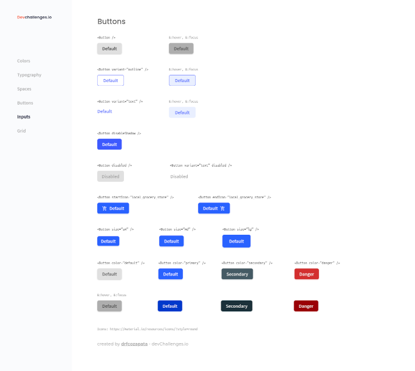

<h1 align="center">Buttons Challenge with Vue.js</h1>

<div align="center">
   Solution for a challenge from  <a href="http://devchallenges.io" target="_blank">Devchallenges.io</a>.
</div>

<div align="center">
  <h3>
    <a href="https://{your-demo-link.your-domain}">
      Demo
    </a>
    <span> | </span>
    <a href="https://github.com/drfcozapata/buttons-challenge">
      Solution
    </a>
    <span> | </span>
    <a href="https://devchallenges.io/challenges/ohgVTyJCbm5OZyTB2gNY">
      Challenge
    </a>
  </h3>
</div>

<!-- TABLE OF CONTENTS -->

## Table of Contents

- [Overview](#overview)
  - [Built With](#built-with)
- [Features](#features)
- [How to use](#how-to-use)
- [Contact](#contact)
- [Acknowledgements](#acknowledgements)

<!-- OVERVIEW -->

## Overview



This is the solution created with Vue.js to the Buttons Challenge of DevChallenge.io.

The Figma model left as a guide was followed strictly and in detail.

We used Vue.js 3 as framework (Script Setup + TypeScript), TailwindCSS and Material Icons. The Vue project was created using Vite and Yarn.

A single component (button) was created and the different buttons indicated by the Figma model were generated using props.

You can see the final result in the Demo.

### Built With

- [Vue.js 3](https://vuejs.org/)
- [Tailwind](https://tailwindcss.com/)
- [Material Icons](https://fonts.google.com/icons)

## Features

This application/site was created as a submission to a [DevChallenges](https://devchallenges.io/challenges) challenge. The [challenge](https://devchallenges.io/challenges/ohgVTyJCbm5OZyTB2gNY) was to build an application to complete the given user stories.

## How To Use

To clone and run this application, you'll need [Git](https://git-scm.com) and [Node.js](https://nodejs.org/en/download/) (which comes with [npm](http://npmjs.com)) installed on your computer. From your command line:

```bash
# Clone this repository
$ git clone https://github.com/drfcozapata/buttons-challenge
$ cd buttons-challenge

# Install dependencies
$ yarn

# Run the app
$ yarn dev
```

## Acknowledgements

<!-- This section should list any articles or add-ons/plugins that helps you to complete the project. This is optional but it will help you in the future. For exmpale -->

- [Node.js](https://nodejs.org/)
- [Marked - a markdown parser](https://github.com/chjj/marked)

## Contact

- Portfolio [drfcozapata.github.io](https://drfcozapata.github.io/)
- Email [drfcozapata@gmail.com](mailto:drfcozapata@gmail.com)
- GitHub [@drfcozapata](https://github.com/drfcozapata)
- Twitter [@drfcozapata](https://twitter.com/drfcozapata)
